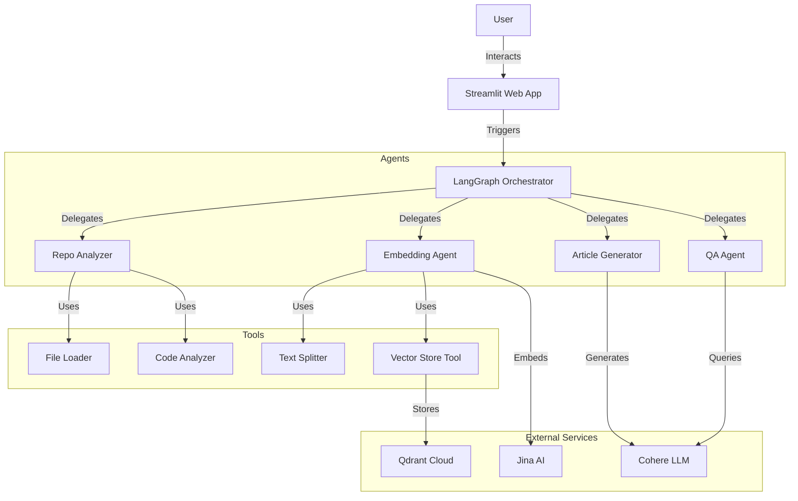

# System Architecture

## Overview
The Multi-Agent Repository Assistant is a sophisticated system designed to analyze software repositories, generate documentation, and answer questions. It leverages a multi-agent architecture orchestrated by LangGraph.

## High-Level Architecture

## Components

### 1. User Interface (Streamlit)
- **Project Management**: Create, update, and delete projects.
- **Repository Analysis**: Trigger analysis of GitHub repositories.
- **Article Generation**: Generate publication-ready articles based on user instructions.
- **Settings**: Configure API keys and preferences.

### 2. Orchestrator (LangGraph)
- Manages the workflow between different agents.
- Ensures data flows correctly from analysis to embedding to generation.

### 3. Agents
- **Repo Analyzer**: Extracts file structure, dependencies, and code metrics.
- **Embedding Agent**: Chunks text and generates embeddings using Jina AI, storing them in Qdrant.
- **Article Generator**: Uses Cohere to generate high-quality technical articles.
- **QA Agent**: Retrieves context from Qdrant and answers user queries.

### 4. Data Storage
- **Local File System**: Stores cloned repositories and project metadata (`projects_data.json`).
- **Qdrant**: Stores vector embeddings for semantic search.

## Security & Resilience
- **Input Validation**: All user inputs (URLs, paths, instructions) are validated and sanitized.
- **Retry Logic**: Network calls to external APIs are wrapped with exponential backoff retries.
- **Logging**: Centralized logging tracks system activity and errors.
